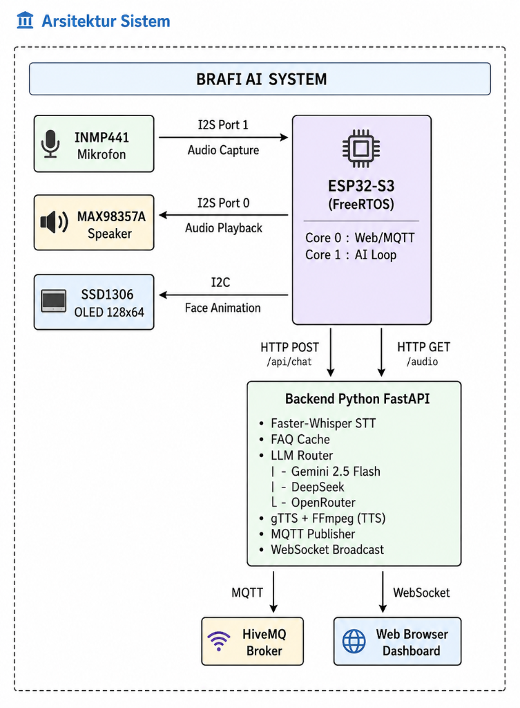
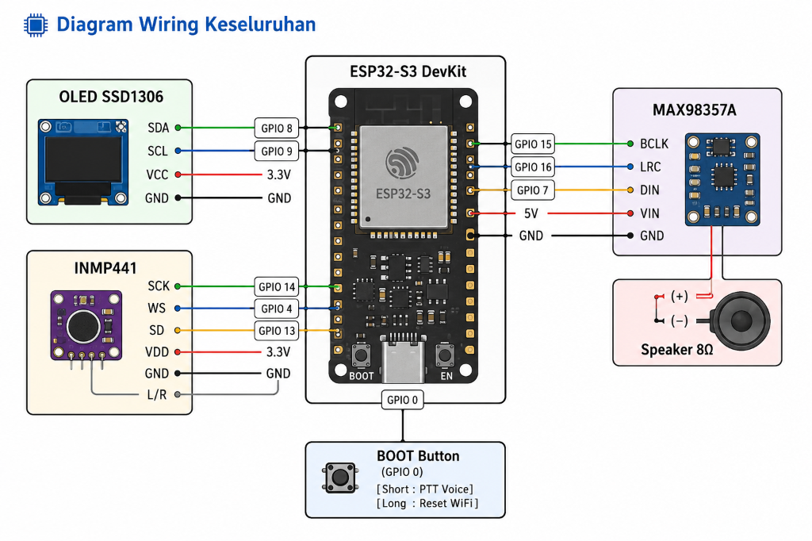
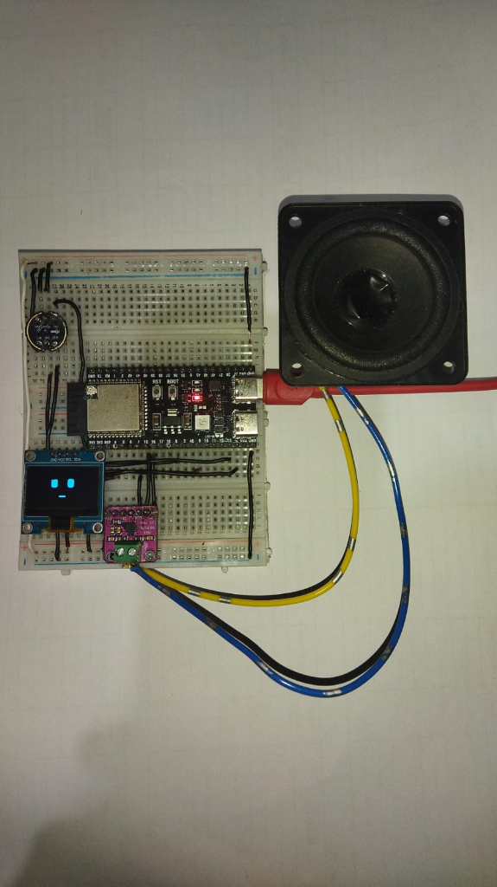
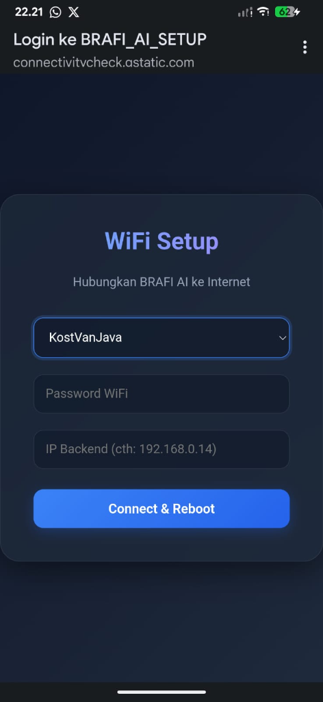
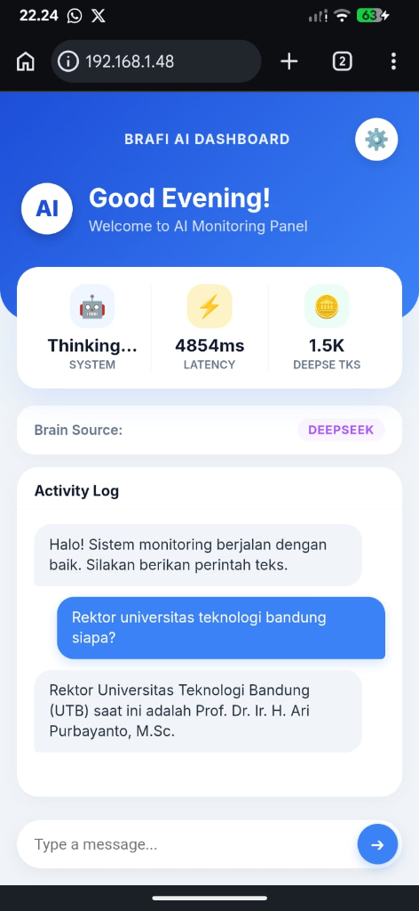
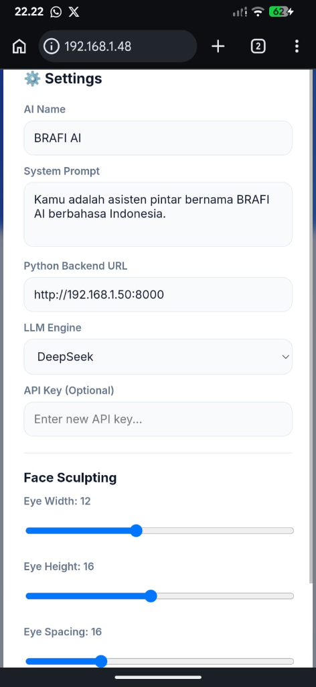

# 🤖 BRAFI AI — Smart Desk Assistant

> **Asisten Meja Pintar berbasis ESP32-S3** dengan kemampuan percakapan suara, animasi wajah OLED, dan integrasi multi-LLM.  
> Dibuat oleh **Kelompok Josjis** — Teknik Informatika, Universitas Teknologi Bandung (UTB)

---

## 📋 Daftar Isi

- [Gambaran Umum](#-gambaran-umum)
- [Arsitektur Sistem](#-arsitektur-sistem)
- [Komponen Hardware](#-komponen-hardware)
- [Rangkaian Wiring](#-rangkaian-wiring)
- [Struktur Project](#-struktur-project)
- [Library & Dependensi](#-library--dependensi)
- [Protokol Komunikasi IoT](#-protokol-komunikasi-iot)
- [Fitur Utama](#-fitur-utama)
- [Cara Menjalankan](#-cara-menjalankan)
- [Web Dashboard](#-web-dashboard)
- [Checklist Syarat UAS](#-checklist-syarat-uas)

---

## 🌟 Gambaran Umum

BRAFI AI adalah perangkat IoT pintar berupa **AI Desk Assistant** yang mampu:

- 🎙️ Mendengarkan suara pengguna melalui mikrofon INMP441
- 🧠 Memproses pertanyaan menggunakan AI (Gemini / DeepSeek / OpenRouter)
- 🔊 Menjawab dengan suara melalui speaker MAX98357A
- 😊 Menampilkan ekspresi wajah animasi di layar OLED SSD1306
- 📡 Berkomunikasi secara realtime via HTTP, MQTT, dan WebSocket
- 🌐 Menyediakan Web Dashboard untuk monitoring dan kontrol

---

## 🏗 Arsitektur Sistem



<details>
<summary>📐 Diagram ASCII (Text Version)</summary>

```text
┌──────────────────────────────────────────────────────────────────┐
│                        BRAFI AI SYSTEM                           │
├──────────────────────────────────────────────────────────────────┤
│                                                                  │
│  ┌─────────────┐     I2S Port 1      ┌──────────────────┐       │
│  │  INMP441     │ ──────────────────► │                  │       │
│  │  Mikrofon    │   Audio Capture     │                  │       │
│  └─────────────┘                      │                  │       │
│                                       │   ESP32-S3       │       │
│  ┌─────────────┐     I2S Port 0      │   (FreeRTOS)     │       │
│  │  MAX98357A   │ ◄────────────────── │                  │       │
│  │  Speaker     │   Audio Playback    │  Core 0: Web/MQTT│       │
│  └─────────────┘                      │  Core 1: AI Loop │       │
│                                       │                  │       │
│  ┌─────────────┐     I2C             │                  │       │
│  │  SSD1306     │ ◄────────────────── │                  │       │
│  │  OLED 128x64 │   Face Animation    │                  │       │
│  └─────────────┘                      └───────┬──────────┘       │
│                                               │                  │
│                          HTTP POST /api/chat  │  HTTP GET /audio │
│                                               ▼                  │
│                                 ┌─────────────────────────┐      │
│                                 │  Backend Python FastAPI  │      │
│                                 │                         │      │
│                                 │  ├─ Faster-Whisper STT  │      │
│                                 │  ├─ FAQ Cache           │      │
│                                 │  ├─ LLM Router          │      │
│                                 │  │   ├─ Gemini 2.5 Flash│      │
│                                 │  │   ├─ DeepSeek        │      │
│                                 │  │   └─ OpenRouter      │      │
│                                 │  ├─ gTTS + FFmpeg (TTS) │      │
│                                 │  ├─ MQTT Publisher      │      │
│                                 │  └─ WebSocket Broadcast │      │
│                                 └─────────────────────────┘      │
│                                        │            │            │
│                              MQTT      │            │  WebSocket │
│                                ▼       │            ▼            │
│                         ┌──────────┐   │    ┌─────────────┐      │
│                         │ HiveMQ   │   │    │ Web Browser │      │
│                         │ Broker   │   │    │ Dashboard   │      │
│                         └──────────┘   │    └─────────────┘      │
│                                        │                         │
└──────────────────────────────────────────────────────────────────┘
```

</details>

### Alur Komunikasi

| Jalur | Protokol | Keterangan |
|---|---|---|
| ESP32 → Backend (audio/teks) | **HTTP POST** multipart | Kirim rekaman suara atau teks chat |
| Backend → ESP32 (reply) | **HTTP Response** JSON | Balasan teks + URL audio TTS |
| ESP32 ← Backend (audio TTS) | **HTTP GET** WAV | Download file suara balasan |
| Backend → MQTT Broker | **MQTT Publish** | Status, token usage, latency |
| MQTT Broker → ESP32 | **MQTT Subscribe** | Remote command (speak, reboot) |
| Backend → Web Browser | **WebSocket** | Dashboard monitoring realtime |
| ESP32 → Web Browser | **HTTP Server** | Serve Web Dashboard HTML |

---

## 🔧 Komponen Hardware

| No | Komponen | Spesifikasi | Fungsi |
|:---:|---|---|---|
| 1 | **ESP32-S3-N16R8** | 16MB Flash, 8MB PSRAM, Dual Core | Mikrokontroler utama |
| 2 | **OLED SSD1306** | 128×64 pixel, I2C | Display animasi wajah |
| 3 | **MAX98357A** | I2S DAC + Amplifier 3W | Output suara (speaker) |
| 4 | **INMP441** | I2S MEMS Microphone | Input suara (mikrofon) |
| 5 | **Speaker 8Ω 3W** | - | Output audio |
| 6 | **Breadboard + Jumper** | - | Koneksi wiring |
| 7 | **Power Supply** | USB-C / 5V | Daya untuk ESP32 |

---

## 🔌 Rangkaian Wiring

### OLED Display SSD1306 (I2C)

| Pin OLED | Pin ESP32-S3 | Keterangan |
|:---:|:---:|---|
| VCC | 3.3V | Power supply |
| GND | GND | Ground |
| SDA | **GPIO 8** | Data I2C |
| SCL | **GPIO 9** | Clock I2C |

> Alamat I2C: `0x3C`

### Speaker — MAX98357A (I2S Port 0)

| Pin MAX98357A | Pin ESP32-S3 | Keterangan |
|:---:|:---:|---|
| VIN | 5V | Power supply |
| GND | GND | Ground |
| BCLK | **GPIO 15** | Bit Clock |
| LRC | **GPIO 16** | Left/Right Clock (Word Select) |
| DIN | **GPIO 7** | Data In (audio) |

> Output: Speaker 8Ω 3W dihubungkan ke terminal `+` dan `-` pada MAX98357A

### Mikrofon — INMP441 (I2S Port 1)

| Pin INMP441 | Pin ESP32-S3 | Keterangan |
|:---:|:---:|---|
| VDD | 3.3V | Power supply |
| GND | GND | Ground |
| SCK | **GPIO 14** | Serial Clock |
| WS | **GPIO 4** | Word Select |
| SD | **GPIO 13** | Serial Data Out |
| L/R | GND | Channel kiri (mono) |

### Diagram Wiring Keseluruhan



### Foto Hardware



> ⚠️ **PENTING:** Pin-pin di atas sudah terbukti stabil. **Jangan diubah** kecuali kabel fisik ikut dipindahkan!

---

## 📁 Struktur Project

```
ESP32-S3/
├── BRAFI_AI/                      # Firmware ESP32 (Arduino C++)
│   ├── BRAFI_AI.ino               # Main program + FreeRTOS task
│   ├── config.h                   # Konfigurasi pin & konstanta
│   ├── audio.cpp / .h             # I2S speaker driver (WAV player)
│   ├── mic.cpp / .h               # I2S mikrofon + VAD recording
│   ├── display.cpp / .h           # OLED SSD1306 driver
│   ├── face_engine.cpp / .h       # Animasi wajah (Idle/Listen/Think/Speak)
│   ├── splash.cpp / .h            # Splash screen & visualizer
│   ├── network.cpp / .h           # WiFi + Captive Portal
│   ├── web.cpp / .h               # Web Dashboard + Settings API
│   ├── gemini.cpp / .h            # HTTP client ke Backend
│   ├── tts.cpp / .h               # Download & play audio TTS
│   ├── mqtt.cpp / .h              # MQTT client (PubSubClient)
│   ├── filesystem.cpp / .h        # SPIFFS file system
│   ├── welcome_wav.h              # Audio sambutan (PROGMEM)
│   └── data/                      # SPIFFS data files
│
├── BRAFI_AI_Backend/              # Backend Python
│   ├── main.py                    # FastAPI server utama
│   ├── requirements.txt           # Dependensi Python
│   ├── .env                       # API keys (JANGAN push ke Git!)
│   ├── tokens.json                # Statistik token tersimpan
│   ├── public/audio/              # Cache file audio TTS
│   └── temp/                      # File temporary Whisper
│
├── README.md                      # Dokumentasi ini
└── dokumentasi.md                 # Dokumentasi teknis tambahan
```

---

## 📚 Library & Dependensi

### Firmware ESP32 (Arduino)

| Library | Versi | Fungsi |
|---|---|---|
| `Arduino.h` | Built-in | Framework dasar |
| `WiFi.h` | Built-in | Koneksi WiFi STA/AP |
| `WebServer.h` | Built-in | HTTP server di ESP32 |
| `HTTPClient.h` | Built-in | HTTP client ke backend |
| `DNSServer.h` | Built-in | DNS untuk Captive Portal |
| `Preferences.h` | Built-in | NVS persistent storage |
| `driver/i2s_std.h` | ESP-IDF v5 | I2S audio (speaker & mic) |
| `esp_heap_caps.h` | ESP-IDF | Alokasi PSRAM |
| `mbedtls/aes.h` | Built-in | Enkripsi AES-128 API key |
| `Wire.h` | Built-in | Protokol I2C |
| **Adafruit SSD1306** | External | Driver OLED display |
| **Adafruit GFX** | External | Grafik library |
| **ArduinoJson** | External | Parsing JSON response |
| **PubSubClient** | External | MQTT client |

### Backend Python

| Library | Fungsi |
|---|---|
| `fastapi` | Web framework REST API |
| `uvicorn` | ASGI server |
| `python-multipart` | Handle form/file upload |
| `aiohttp` | Async HTTP client ke LLM API |
| `gtts` | Google Text-to-Speech |
| `faster-whisper` | Speech-to-Text lokal (model `base`) |
| `paho-mqtt` | MQTT client publish/subscribe |
| `pytz` | Timezone (WIB) |
| `ffmpeg` (system) | Konversi MP3 → WAV 16kHz |

### Instalasi Dependensi Backend

```bash
cd BRAFI_AI_Backend
pip install -r requirements.txt
```

**requirements.txt:**

```text
fastapi
uvicorn
python-multipart
aiohttp
gtts
faster-whisper
paho-mqtt==1.6.1
pytz
```

> ⚠️ Pastikan `ffmpeg` terinstall di system: `sudo apt install ffmpeg`

---

## 📡 Protokol Komunikasi IoT

### 1. HTTP (ESP32 ↔ Backend)

Komunikasi utama antara firmware dan backend menggunakan HTTP REST API.

**Endpoints Backend:**

| Method | Endpoint | Fungsi |
|---|---|---|
| `POST` | `/api/chat` | Kirim audio/teks, terima balasan AI + URL audio |
| `POST` | `/api/transcribe` | Transkripsi audio ke teks |
| `GET` | `/api/token-stats` | Statistik penggunaan token LLM |
| `POST` | `/api/set-llm` | Ganti model LLM aktif |
| `GET` | `/api/llm-status` | Status LLM dan token |
| `GET` | `/` | Health check server |

**Endpoints ESP32 (Web Dashboard):**

| Method | Endpoint | Fungsi |
|---|---|---|
| `GET` | `/` | Halaman Web Dashboard |
| `GET` | `/api/status` | Status AI saat ini |
| `POST` | `/api/chat` | Kirim pesan teks dari dashboard |
| `GET` | `/api/chat_reply` | Polling balasan AI |
| `GET` | `/api/settings` | Ambil konfigurasi |
| `POST` | `/api/settings` | Simpan konfigurasi |
| `POST` | `/api/face` | Atur parameter wajah |
| `GET` | `/api/scan` | Scan WiFi (mode AP) |

### 2. MQTT (Monitoring & Remote Control)

**Broker:** `broker.hivemq.com` port `1883`

**Topics yang di-Publish (Backend → Broker):**

| Topic | Payload | Keterangan |
|---|---|---|
| `brafi/status` | `Ready` / `Thinking` / `Speaking` | Status AI |
| `brafi/token/last_prompt` | integer | Token prompt terakhir |
| `brafi/token/last_reply` | integer | Token reply terakhir |
| `brafi/token/last_total` | integer | Token total terakhir |
| `brafi/token/session_total` | integer | Akumulasi token sesi |
| `brafi/token/source` | `gemini` / `deepseek` / `faq_cache` | Sumber jawaban |
| `brafi/reply` | string (max 200 char) | Teks balasan AI |
| `brafi/latency_ms` | integer | Waktu proses (ms) |
| `brafi/heap` | integer | Free heap ESP32 |

**Topics yang di-Subscribe (ESP32):**

| Topic | Aksi |
|---|---|
| `brafi/command/speak` | TTS-kan teks yang diterima |
| `brafi/command/reset_wifi` | Hapus WiFi credentials & restart |
| `brafi/command/reboot` | Restart ESP32 |

### 3. WebSocket (Dashboard Realtime)

Endpoint: `ws://<backend-ip>:8000/ws`

Browser terhubung ke backend via WebSocket untuk menerima update realtime:

- Status AI
- Latency
- Token usage
- Sumber LLM
- Balasan terakhir

### 4. I2C (ESP32 → OLED Display)

- Alamat: `0x3C`
- Pin: SDA=GPIO8, SCL=GPIO9
- Digunakan untuk animasi wajah FaceEngine

### 5. I2S (ESP32 ↔ Audio)

- **Port 0 (TX):** Speaker MAX98357A — output audio TTS
- **Port 1 (RX):** Mikrofon INMP441 — input rekaman suara
- Format: 16kHz, 16-bit PCM

---

## ✨ Fitur Utama

### 🎙️ Voice Activity Detection (VAD)

Sistem deteksi suara otomatis dengan:

- Dynamic Noise Floor (adaptif terhadap noise ruangan)
- Anti-Clap & RMS Filter (mencegah false trigger)
- Push-to-Talk via tombol BOOT (GPIO 0)
- Maksimal rekaman 12 detik

### 🧠 Multi-LLM Router

Backend mendukung 3 model AI dengan fallback otomatis:

1. **Gemini 2.5 Flash** — Model utama (Google)
2. **DeepSeek V4 Flash** — Fallback saat Gemini limit
3. **OpenRouter GPT-OSS 120B** — Fallback terakhir (gratis)

### 💬 FAQ Cache (Offline)

Jawaban instan tanpa API untuk pertanyaan umum (sapaan, identitas, kampus).

### 📊 Token Tracking

Monitoring penggunaan token per model, per sesi, dan total kumulatif.

### 🗣️ Text-to-Speech Pipeline

```
Teks Balasan → gTTS (MP3) → FFmpeg → WAV 16kHz Mono → HTTP → ESP32 → I2S Speaker
```

### 😊 Face Engine (Animasi Wajah OLED)

4 state animasi ekspresif:

- **Idle** — Mata berkedip & melirik random
- **Listening** — Mata membesar, mulut "O"
- **Thinking** — Satu mata menyipit, melirik atas
- **Speaking** — Mulut bergerak dinamis sinkron suara

### 🔒 Security

- API key dienkripsi AES-128-ECB di NVS (Preferences)
- WiFi credentials disimpan di NVS, bukan di source code
- Key derivation: MAC Address + Salt

### 📱 Captive Portal WiFi Setup

- Jika WiFi gagal → ESP32 menjadi AP `BRAFI_AI_SETUP`
- User terhubung ke AP → setup WiFi via browser
- Otomatis restart dan connect ke WiFi baru

### ⚙️ FreeRTOS Dual-Core

| Core | Task | Fungsi |
|:---:|---|---|
| Core 0 | `webTask` | Web Server, MQTT Loop, Button Handler |
| Core 0 | `faceTask` | Animasi wajah OLED (~20 FPS) |
| Core 1 | `loop()` | AI processing, TTS playback, VAD |

Komunikasi antar-core menggunakan **FreeRTOS Queue** (thread-safe).

---

## 🚀 Cara Menjalankan

### 1. Setup Backend Python

```bash
# Clone/masuk ke folder backend
cd BRAFI_AI_Backend

# Install dependensi
pip install -r requirements.txt

# Pastikan ffmpeg terinstall
sudo apt install ffmpeg

# Konfigurasi API key di file .env
# GEMINI_API_KEY="your_key_here"
# DEEPSEEK_API_KEY="your_key_here"
# OPENROUTER_API_KEY="your_key_here"

# Jalankan server
uvicorn main:app --host 0.0.0.0 --port 8000
```

### 2. Flash Firmware ESP32

1. Buka **Arduino IDE** atau **PlatformIO**
2. Install board **ESP32-S3** via Board Manager
3. Install library: `Adafruit SSD1306`, `Adafruit GFX`, `ArduinoJson`, `PubSubClient`
4. Buka file `BRAFI_AI/BRAFI_AI.ino`
5. Pilih board: **ESP32-S3 Dev Module**
6. Settings: PSRAM → **OPI PSRAM**, Flash Size → **16MB**
7. Upload firmware ke ESP32

### 3. Konfigurasi Pertama Kali

1. ESP32 akan membuat AP WiFi: **BRAFI_AI_SETUP**
2. Hubungkan HP/laptop ke AP tersebut
3. Buka browser → otomatis redirect ke halaman setup
4. Pilih WiFi, masukkan password, dan IP backend
5. Klik **Connect & Reboot**
6. ESP32 restart dan terhubung ke WiFi + Backend



### 4. Akses Web Dashboard

Buka browser dan akses: `http://<IP-ESP32>/`

---

## 🌐 Web Dashboard

Dashboard monitoring dan kontrol BRAFI AI yang berjalan di ESP32:

- **Status Card** — System status, Latency, Token usage
- **Brain Source Badge** — Menampilkan LLM aktif (Gemini/DeepSeek/FAQ)
- **Chat Interface** — Kirim pesan teks ke AI
- **Settings Panel:**
  - AI Name (customizable)
  - System Prompt
  - Backend URL
  - LLM Engine selector
  - API Key input (terenkripsi)
  - Face Sculpting (Eye width/height, spacing, mouth)

| Dashboard Utama | Settings Panel |
|:---:|:---:|
|  |  |

---

## ✅ Checklist Syarat UAS

| No | Poin UAS | Status | Implementasi |
|:---:|---|:---:|---|
| 1 | **ESP32** | ✅ | ESP32-S3-N16R8 sebagai mikrokontroler utama |
| 2 | **HTTP** | ✅ | HTTP POST audio/teks ke backend, HTTP GET audio TTS, REST API endpoints |
| 3 | **MQTT** | ✅ | Publish: status, token, reply, latency, heap. Subscribe: speak, reset, reboot. Broker: HiveMQ |
| 4 | **WebSocket** | ✅ | Realtime dashboard update (Backend → Browser) via `ws://backend/ws` |
| 5 | **Tampilan Web** | ✅ | Web Dashboard responsive di ESP32 (chat, monitoring, settings, face sculpting) |
| 6 | **RTOS** | ✅ | FreeRTOS dual-core: Core 0 (Web+MQTT+Face), Core 1 (AI+Audio). Queue thread-safe |
| 7 | **Machine Learning** | ✅ | Faster-Whisper STT (speech-to-text lokal, model `base`). VAD dengan RMS & dynamic noise floor |
| 8 | **LLM / AI** | ✅ | Gemini 2.5 Flash + DeepSeek + OpenRouter (multi-LLM router dengan auto-fallback) |
| 9 | **Security** | ✅ | AES-128-ECB enkripsi API key di NVS. WiFi credentials di Preferences (bukan hardcode). Captive Portal |
| 10 | **Sensor / Aktuator** | ✅ | Mikrofon INMP441 (sensor suara), Speaker MAX98357A (aktuator audio), OLED SSD1306 (aktuator visual) |
| 11 | **IoT Protokol** | ✅ | HTTP + MQTT + WebSocket + I2C + I2S (5 protokol) |
| 12 | **Conversation History** | ✅ | History per session (IP-based), auto-trim 3 turn, persistent across requests |
| 13 | **FAQ Cache** | ✅ | 25+ jawaban offline tanpa API (sapaan, identitas, kampus) |
| 14 | **Token Tracking** | ✅ | Per-model, per-session, kumulatif. Tersimpan di `tokens.json` |
| 15 | **Audio Pipeline** | ✅ | gTTS → FFmpeg → WAV 16kHz → HTTP download → I2S playback. Audio caching (hash-based) |

---

## 🔧 Konfigurasi Audio

| Parameter | Nilai | Keterangan |
|---|---|---|
| Sample Rate | 16,000 Hz | Standar untuk speech |
| Bit Depth | 16-bit | PCM signed |
| Channel | Mono | 1 channel |
| VAD Trigger Margin | 20 | Selisih volume di atas noise floor |
| VAD Silence Timeout | 1500 ms | Waktu diam sebelum berhenti merekam |
| VAD Max Record | 12000 ms | Durasi maksimal rekaman |
| TTS Output Gain | 0.5 | Volume output (0.0 - 1.0) |

---

## 📝 Catatan Penting

1. **Pin Hardware** sudah terbukti stabil — jangan diubah tanpa memindahkan kabel fisik
2. **PSRAM** wajib diaktifkan untuk buffer audio (ESP32-S3-N16R8 memiliki 8MB PSRAM)
3. Backend dan ESP32 harus berada di **jaringan WiFi yang sama**
4. Tombol **BOOT** (GPIO 0):
   - Tekan singkat → Push-to-Talk (rekam suara)
   - Tahan >2 detik → Reset WiFi credentials

---

## 👥 Tim Pengembang

**Kelompok 9 — Josjis BRAFI**  
Program Studi Teknik Informatika, Universitas Teknologi Bandung (UTB)

| No | Nama | NPM |
|:---:|---|---|
| 1 | Fauzi Rikhshana | 23552011030 |
| 2 | Raihan Maulana Fadly | 23552011014 |
| 3 | Bayu Aji Prayoga | 23552011194 |

---

# Link Video Dokumentasi
https://drive.google.com/drive/folders/1SxNPBfp_LTKAXSSYkYL-Dz_gQ5PdT0Zw?hl=ID


*Dokumentasi ini dibuat sebagai pelengkap tugas UAS Internet of Things (IoT).*
*Terakhir diperbarui: 28 Juni 2026*
